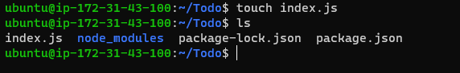
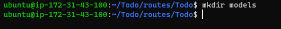
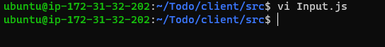
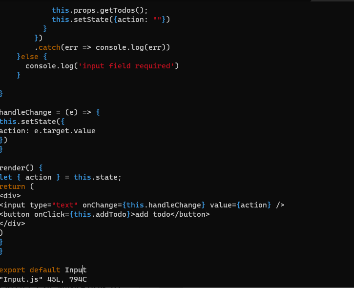

# PROJECT 3: MERN STACK IMPLEMENTATION

SIMPLE TO-DO APPLICATION ON MERN WEB STACK

Step 0 : Preparing prerequisites

- Sign in to AWS free tier account and create a new EC2 Instance of t2.nano family with Ubuntu Server 20.04 LTS or 22.04 LTS, (HVM) image.
  
- Connect to this instance via SSH.

STEP 1 : BACKEND CONFIGURATION

Update ubuntu

`sudo apt update`

Upgrade ubuntu

`sudo apt upgrade`

Get the location of Node.js software from Ubuntu repositories

`curl -fsSL https://deb.nodesource.com/setup_18.x | sudo -E bash -`

Install Node.js on the server with the command below

`sudo apt-get install -y nodejs`

both nodejs and npm (Package manager for Node) are installed

Verify the node installation with the command below

`node -v`

Verify the node installation with the command below

`npm -v`

***Application Code Setup***

Create a new directory for your To-Do project:

`mkdir Todo`

`ls`

Now change your current directory to the newly created one:

`cd Todo`

Initialize your project

`npm init`

Press Enter several times to accept default values, then accept to write out the package.json file by typing yes.

To use express, install it using npm

`npm install express`

Now create a file index.js with the command below

`touch index.js`

Run ls to confirm that your index.js file is successfully created

Install the dotenv module

`npm install dotenv`

Open the index.js file with the command below

`vim index.js`

To start the server to see if it works, Open the terminal in the same directory as the index.js file and type:

`node index.js`

Since an inbound rule to open TCP port 5000 was already created in step 0, open up your browser and try to access your server’s Public IP or Public DNS name followed by port 5000:

Create routes that will define various endpoints that the To-do app will depend on. So create a folder routes

`mkdir routes`

Change directory to routes folder

`cd routes`

create a file api.js

`touch api.js`

Open the file

`vim api.js`

Copy and paste the new code

To create a Schema and a model, install mongoose which is a Node.js package that makes working with mongodb easier.

Change directory back to "Todo" folder and install Mongoose

`cd Todo`

`npm install mongoose`

Create a new folder models :

`mkdir models`

`cd models`

`touch todo.js`

Open the file

`vim todo.js`

In Routes directory, open api.js

`:%d`

paste the code

***Create a MongoDB database and collection inside mLab***

In the index.js file, we specified process.env to access environment variables, but we have not yet created this file. So we need to do that now.

Create a file in your "Todo" directory, and name it ".env"

`touch .env`

`vi .env`

Add the connection string to access the database in it, just as below:

`DB = 'mongodb+srv://<username>:<password>@<network-address>/<dbname>?retryWrites=true&w=majority'`

update the index.js

`vim index.js` `esc` `:` `%d`

Start your server

Database connected successfully.

Now open your Postman, create a POST request to the API

"http://3.17.208.229:5000/api/todos"

Create a GET request to your API on "http://3.17.208.229:5000/api/todos"

In the "Todo" directory, run:

`npx create-react-app client`

Install *concurrently*. It is used to run more than one command simultaneously from the same terminal window.

`npm install concurrently --save-dev`

Install *nodemon*. It is used to run and monitor the server. If there is any change in the server code, nodemon will restart it automatically and load the new changes.

`npm install nodemon --save-dev`

In "Todo" folder open the package.json

Change the highlighted part of the script and replace with the new code.

***Configure "Proxy" in "package.json"***

Change directory to ‘client’

`cd client`

Open the package.json file

`package.json`

Add the key value pair in the package.json file "proxy": "http://localhost:5000".

Inside the "Todo" directory, run:

`npm run dev`

Your app should open and start running on localhost:3000

*Creating your React Components**

From your "Todo" directory run

`cd client`
`cd src`

Inside your src folder create another folder called components

`mkdir components`

Move into the components directory

`cd components`

Inside ‘components’ directory create three files Input.js, ListTodo.js and Todo.js.

`vi Input.js`

Copy and paste new script

To make use of Axios, Move to the src folder

`cd ..` `cd ..`

Install Axios

`npm install axios`

Go to ‘components’ directory

`cd src/components`

After that open your ListTodo.js

`vi ListTodo.js`

Then in your Todo.js file you write the following code

We need to make little adjustment to our react code. Delete the logo and adjust our App.js

Move to the src folder

`cd ..` `vi App.js`

Edit the code

Exit the editor. In the src directory

`vi App.css`

Exit

`vim index.css`

Go to the "Todo" directory

`cd ../..`

`npm run dev`

